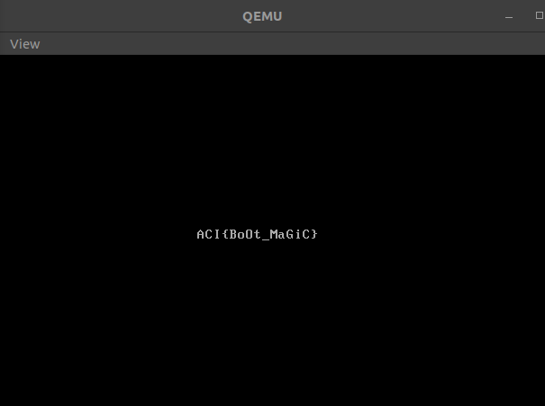

# CTF: All-Army Cyberstakes 2020

- Challenge: Bootcamp    
- Category: Forensics    	
- Points: 20   
- Difficulty: Introductory    

## Instructions:

We found an old floppy-drive laying around and think that there may be a flag hidden on it somewhere. We managed to copy the drive image, but there doesn't appear to be any kind of filesystem on it. In fact, all of the data appears to be on the first sector of the disk.

## Hints:

It looks like file floppy.img identifies it as a "DOS/MBR Boot Record"...

What happens if you try booting the image?

You probably don't have a real floppy drive that you can use, but what about a 'virtual' one?

qemu-system-i386 floppy.img is our favorite means of 'booting' floppies, but 'Virtual Box' and 'bochs' are other alternatives (and they are all free).

## Solution

In the challenge we are given files.tar.gz archive file and we are told that there is a flag hidden somewhere on this old floppy-drive.

We are also told that the data appears to be on the first sector of the disk.

I extracted the image file using the following commands. 

`gunzip files.tar.gz`
`tar -xvf files.tar`

After running these commands we get our  file. If we run file command on the file we learn that the file is DOS/MBR boot sector. 

Lets try to boot the image to see its contents. 

In the hints we are told that the `qemu-system-i386` is the authors favorite means of booting floppies. 

I ran the command `qemu-system-i386 floppy.img` and got the flag. 

 

## Flag

`ACI{Bo0t_MaGiC}`

## Mitigation:

One way of mitigating this problem would be being careful with putting sensitive information on a floppy drive which may be accessible to others. Also it would be helpful to encrypt the data on the disk.

