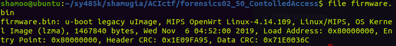
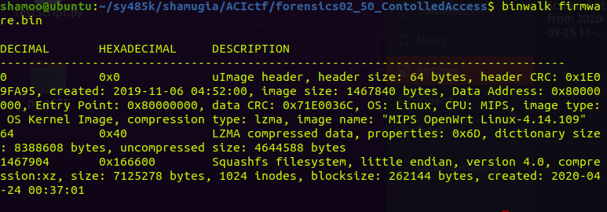
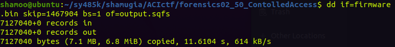
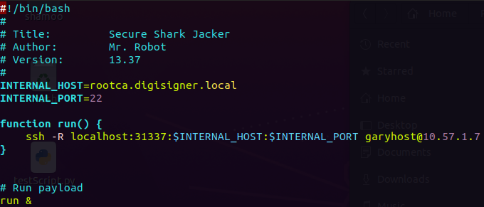

# CTF: All-Army Cyberstakes 2020

- Challenge: Controlled Access    
- Category: Forensics    	
- Points: 50   
- Difficulty: Introductory    

## Instructions:

We've been asked to help a certificate authority figure out what a device they found plugged into their network was doing. They were able to dump the firmware and would like to know if it allowed the attacker to connect to any devices that their firewall (which blocks inbound SSH) would have stopped. Their internal domain uses 'digisigner.local' for DNS host names. The flag is the hostname of the internal host that the hacker targeted (i.e. ACI{[local hostname targeted]}).

## Hints:

A tool like binwalk might be useful for inspecting the firmware.

The documentation mentions that the 'attack' payload for this device lives in a very particular spot on the filesystem...

## Solution

We are given [firmware.bin](https://gitlab.usna.edu/cyberopsmidncourses/sy485k/shamugia/-/blob/master/ACIctf/forensics02_50_ContolledAccess/firmware.bin) file and are told to examine what was the device that was found plugged into the network doing. We are also told that the flag is the hostname of the internal host that the hacker targeted. 

I started by running file command on the file. 

file says its a u-boot legacy uImage. If we run binwalk on the file (as stated in the hints) we learn more about the file.

one thing that stands out here is the squashfs filesystem. I found this [cool article](https://eforensicsmag.com/file-system-analysis-with-binwalk/) about the topic which we are interested in. 

Using what we learned from the article I extracted the squashfs filesystem using the dd command. 

In the hints we also got a link to the documentation of the payload, and we learned that the payoad resides in /root/payload directory.

In the summary we were told that the flag is the name of the internal host, which from the payload.sh appears to be "rootca.digisigner.local"

## Flag

`ACI{rootca.digisigner.local}`

## Mitigation:

In order to mitigate such problem we can disallow the devices such as the one in the problem to be connected to the computer.

This is a problem which exists in the real world especially in the military and government organizations.

