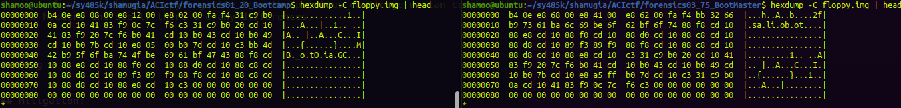
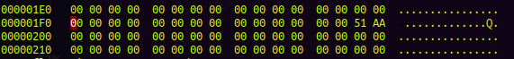
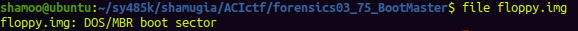
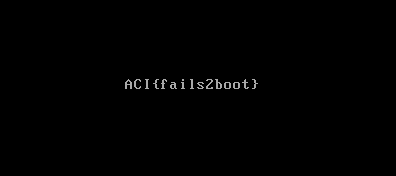

# CTF: All-Army Cyberstakes 2020

- Challenge: Boot Master    
- Category: Forensics    	
- Points: 75   
- Difficulty: Introductory    

## Instructions:

We found another floppy disk image, but we can't get this one to boot like we did the last one. The disk had been sitting around for a while so we're wondering if some of the data was corrupted. Any ideas?

## Hints:

It looks like file floppy.img identifies this one as just "data"...

How does file recognize that an image contains a master boot record?

You'll probably need some kind of 'hex editor' for this problem.

Can we change one bit in the image and fix the problem?

## Solution

After extracting the given zip file we get the floppy.img but inlike the previous floppy.img from the challenge bootcamp the file command tells us that this is a data file. We know from the challenge summary that the file is supposed to be a floppy disk image.

My first thought in order to complete this challenge was to check the file header on the file.

Since we have a working floppy.img file from the previous challenge we can compare the file headers and see if there are any differences. 

floppy.img file header from challenge "BootCamp" 
`b4 0e e8 08 00 e8 12 00  e8 02 00 fa f4 31 c9 b0`

floppy.img file header from challeneg "Boot Master"
`b4 0e e8 68 00 e8 41 00  e8 62 00 fa f4 bb 32 66`

We can see that the file header in this challenge is corrupted therefore the file is interpreted as a data file instead of a boot image. 

We can use a tool called hexedit to make proper adjustments and fix the file header.

After making those changes unfortunately the file did not get fixed. 

After looking at the hints I learned two very important pieces. One hint was how does the file recognize that the image contains boot data. Another useful hint was that we only needed to change one bit. 

I redownloaded the file and started reading up on the 

Wikipedia page on Master Boot Record tells us that the MBR signature that appears in a disk editor is `55 AA`

However our signature seems to be corrupted.

Let's try changing `51 AA` to `55 AA`. 

And here we go! running the file command now tells us that the file is DOS/MBR boot sector. 

After opening the img file with qemu we find our flag!

## Flag

`ACI{fails2boot}`

## Mitigation:

We have to make sure that the files are not corrupted, although it might not always be the easiest task to do it may lead to many problems such as the malicious actor sneaking some executable on our system.
