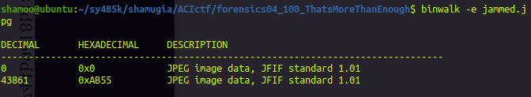
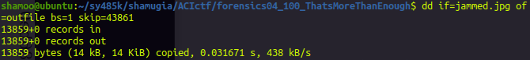
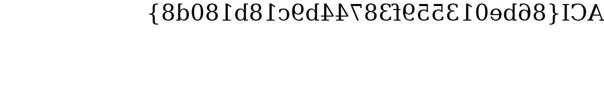

# CTF: All-Army Cyberstakes 2020

- Challenge: That's More Than Enough    
- Category: Forensics    	
- Points: 100   
- Difficulty: Introductory    

## Instructions:

We think Jolly Jeff is up to no good. See if you can find the hidden message in his JPEG Jammer.

## Hints:

Hex editors, such as bless or wxHexEditor, are great for viewing file contents. Install bless with "sudo apt install bless" or wxhexeditor with "sudo apt install wxhexeditor".

Take a look at the JPEG file format specification.

## Solution

In this problem we are given a website which we are told is a JPEG Jammer. Given a JPEG file it can perfom operations on it such as rotating, flipping, negating, etc. 

I found a JPEG image of the linux logo and flipped it usingf the Jolly Jeff JPEG Jammer

Original:

Flipped:

After downloading the flipped image I tried running strings on the file to see if there was anything hidden in the strings. After this method being unsuccessful, I ran binwalk on the file and got something interesting.

We can see that there are two JPEG images in this file. Lets try to extract the JPEG image at the offset 43861 into a new file.

Lets see what is the file that we extracted.

This looks like our flag!

## Flag

`ACI{86be013559f38744b9c18b180d8}`

## Mitigation:

Files that seem normal to us might have something hidden in them. The hidden file might be harmful for our computer therefore we have to make sure we analyze such files and detect any anomalies.
