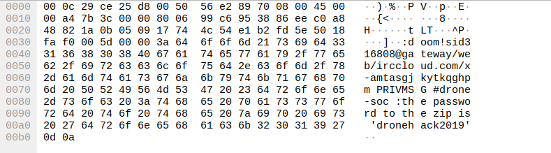
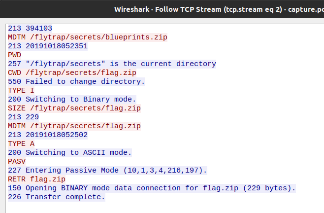
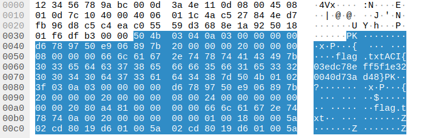

# CTF: All-Army Cyberstakes 2020

- Challenge: Turtles All the Way Down    
- Category: Forensics    	
- Points: 100   
- Difficulty: Introductory    

## Instructions:

Early this morning, a breach occurred on the server hosting our next-gen drone development repository. It is your job to figure out what was taken: [challenge.zip](https://gitlab.usna.edu/cyberopsmidncourses/sy485k/shamugia/-/blob/master/ACIctf/forensics05_100_TurtlesAllTheWayDown/challenge.zip)

## Hints:

Our analysts are using IRC to share information and investigate this breach

Everything you need lives within these PCAP's, you simply need to carve out the relevant files

These ZIPS appear to have been generated with 7z

FTP is a simple text-based protocol, with passive binary streams for file transfers

## Solution

We are given a packet capture in the challenge. I solved the challenge using wireshark. 

There is some interesting information we find in the packet capture.

Wireshark enables us to export files from the packet capture. If we export objects (http) we get a 7z zip file.

The archive file seems to be protected with a password. If we look further in the packet capture in one of the tcp streams we find the password for the archive file.

Once we extract the files using the password we get another capture.pcap file. The capture contains tcp and ftp packets. 

When we follow tcp stream we can see some interesting activity.

Right after ftp RETR command which we see in packet #123 we get the flag in packet #129

## Flag

`ACI{03edc78eff5f1e320040d73ad48}`

## Mitigation:

We can see lot of sensitive information in plaintext in Wireshark packet capture. We have to make sure we use encrypted comms in order to avoid being detected. 
