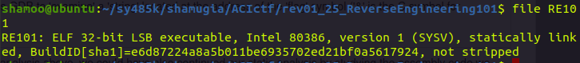
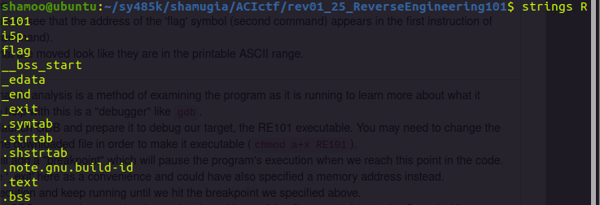
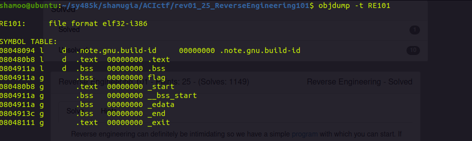
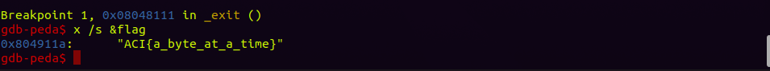

# CTF: All-Army Cyberstakes 2020

- Challenge: Reverse Engineering 101    
- Category: Reverse Engineering    	
- Points: 25   
- Difficulty: Introductory    

## Instructions:

Reverse engineering can definitely be intimidating so we have a simple program with which you can start. If you don't know where to start, check out the hints where we'll walk you through two different ways to solve this problem.

## Hints:

Static analysis: Static analysis is a process for examining a program without having a computer execute any code.

    From a command line on Linux, executing objdump -d RE101 will display the assembly code for the executable sections of the program (assumes you downloaded the file to the same folder).
    Flow of this program starts at _start and proceeds 'down' the code.
    objdump -t RE101 will print all of the 'symbols' in the program. These are human-readable names for specific spots in memory. Symbols in the '.text' section tend to be function names and symbols in '.bss', '.data', and '.rodata' tend to be variable names.
    You should be able to see that the address of the 'flag' symbol (second command) appears in the first instruction of the '_start' (first command).
    The hex values that are moved look like they are in the printable ASCII range.

Dynamic analysis: Dynamic analysis is a method of examining the program as it is running to learn more about what it does. A common tool to help with this is a "debugger" like gdb.

    gdb RE101 will launch GDB and prepare it to debug our target, the RE101 executable. You may need to change the permissions on the downloaded file in order to make it executable (chmod a+x RE101).
    break _exit will add a "breakpoint" which will pause the program's execution when we reach this point in the code. We're able to use '_exit' here as a convenience and could have also specified a memory address instead.
    run will start execution and keep running until we hit the breakpoint we specified above.
    x /s &flag tells GDB to 'examine' a 'string' located at the address of the 'flag' symbol ('&' is the C symbol for 'address of').

Instead of the dynamic analysis above, we could have also continued our static analysis by studying the assembly code we produced earlier. In particular, we can observe that the code is moving a pointer to the 'flag' variable into the EDI register in the first line. It then 'moves' a series of byte-constants into the memory location to which EDI points, 'incrementing' EDI in between each move. The final three lines in '_exit' execute a Linux system call to 'exit', but that is relevant for this problem.When doing reverse engineering of x86 and x86-64 programs, Intel's instruction set reference can be very helpful. It can be intimidating to look at, but looking up the assembly instruction in this document will tell you exactly what it does.

## Solution

This introductory problem gives us an file called RE101.

Just like any other file lets figure out what this file actually is before starting to work on it. For this I ran a file command.

We can see that the file is ELF 32-bit LSB executable, intel architecture, statically linked and it is not stripped. 
 
We can run strings command on the file and see the functions and libraries in the program since it is not stripped.

Another way we can see the symbols in the program is running objdump on the file with the option -t.

We can see _exit which we can assume is the last thing the program does during execution. We can set a breakpoint at _exit and examine the memory up to that point.

We can also see the flag variable and just by a guess we can assume that this variable will contain our flag. 

 
## Flag

`ACI{a_byte_at_a_time}`

## Mitigation:

