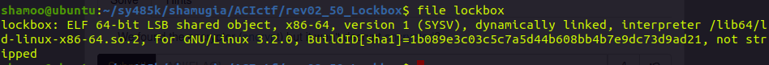
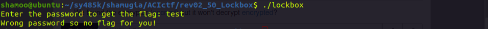
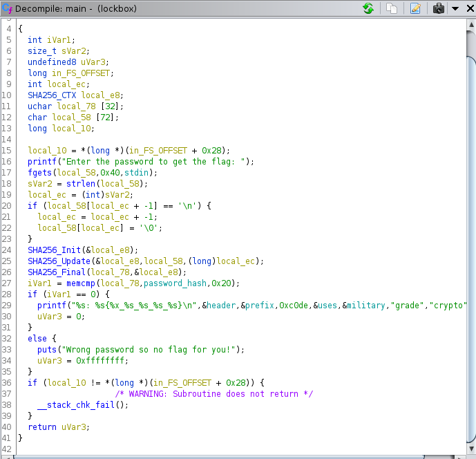
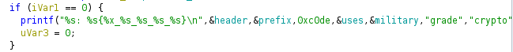
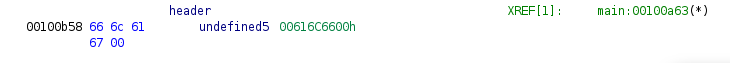
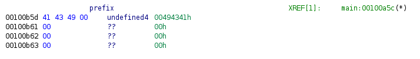
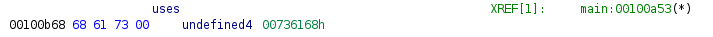
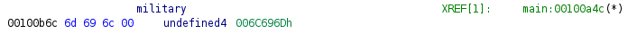

# CTF: All-Army Cyberstakes 2020

- Challenge: Lockbox    
- Category: Reverse Engineering    	
- Points: 50   
- Difficulty: Introductory    

## Instructions:

We developed this password-protected program which uses a super-secure, military-grade hash function with 256-bits of security to ensure only someone with the proper password can print the flag.

## Hints:

You do not need to crack the password.

Tools like ghidra are helpful when strings isn't enough.

Looking at calls to printf and puts is probably a good place to start.

## Solution

We are given a 64-bit executable, x86-64 architecture, dynamically linked, not stripped.

When we run the executable we are prompted for the password. 

We can open the file in ghidra and perform static analysis.

One thing that looks very interesting is this printf call

 
The string printed seems to be printing the value at variable "header", "prefix", "uses" and "military" combined with the strings "c0de", "grade", "crypto"

We can see what are the bytes inside those variables and try to decode the message. 

the bytes 0x66 0x6c 0x61 0x67 decode to ASCII: "flag"

bytes 0x41 0x43 0x 49 decodeto ASCII: "ACI"

bytes 0x68 0x61 0x73 decode to ASCII: "has"

bytes 0x6d 0x69 0x6c decode to ASCII: "mil"

If we combine the string in printf using what we know we get "flag: ACI{c0de_has_mil_grade_crypto}"

## Flag

`ACI{c0de_has_mil_grade_crypto}`

## Mitigation:

