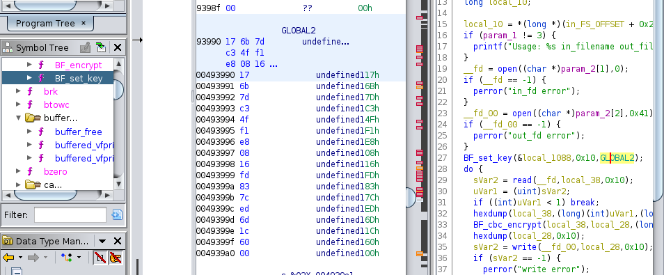

# CTF: All-Army Cyberstakes 2020

- Challenge: National Dex #65    
- Category: Reverse Engineering    	
- Points: 100   
- Difficulty: Introductory    

## Instructions:

We found the encryptor (encrypt) but it won't decrypt encrypted?

## Hints:

I think they're using a cipher designed by Bruce Schneier.

When reversing, it's useful to look for magic constants or use a tool like findcrypt (idapython version or Ghidra version).

Make sure you're using CBC mode.

## Solution

We are given an executable which seems to be using some type of encryption (which we do not know) and outputs the "encrypted" file.

After some initial static analysis of the program I decided to look at the hints.

Hints tells us that the cipher used was designed by Bruce Schneier. We are also told to look for magic constants. 

After some google searches I found Blowfish. Which seems to be a encryption cypher designed by Bruce Shneier. 

Wikipedia:
Blowfish's key schedule starts by initializing the P-array and S-boxes with values derived from the hexadecimal digits of pi, which contain no obvious pattern (see nothing up my sleeve number). The secret key is then, byte by byte, cycling the key if necessary, XORed with all the P-entries in order. A 64-bit all-zero block is then encrypted with the algorithm as it stands. The resultant ciphertext replaces P1 and P2. The same ciphertext is then encrypted again with the new subkeys, and the new ciphertext replaces P3 and P4. This continues, replacing the entire P-array and all the S-box entries. In all, the Blowfish encryption algorithm will run 521 times to generate all the subkeys - about 4KB of data is processed.

We can see the program initializing P and S values 

As we know the encryption cipher uses a key and the IV to perform the encryption. All we need to do is find those values in order to decrypt the message. 

The Key and IV should be passed to the BF_set_key function.

Inside main function we find the call to BF_set_key with GLOBAL2 as an argument.

These 16 bytes could be our key! If we look a little further in main we can see the call to BF_cbc_encrypt where one of the arguments is GLOBAL1.

This looks like a good candidate for our IV, since it's 8 bytes.

We can write a python script which uses Blowfish crypto module to decrypt the message with the known IV and Key.

## Flag

`ACI{a1470b308d20c6475f5958deb30}`

## Mitigation:

In order for the encryption to be successful we have to use random IV and Key values.

Another problem with the encryption is that even if we hadn't known the Key and IV Blowfish uses 64-bit block size which makes it vulnerable to birthday attacks.

