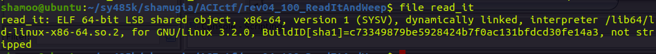
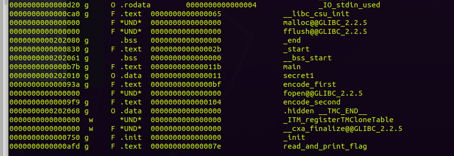
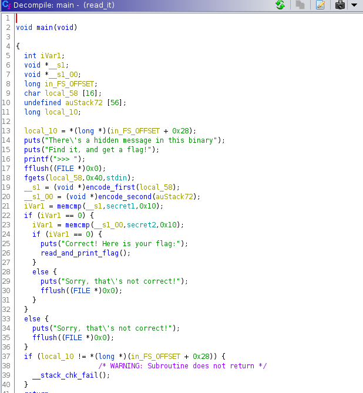
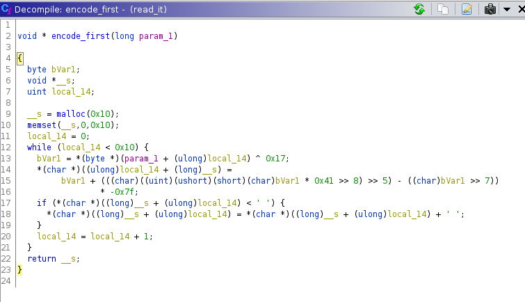
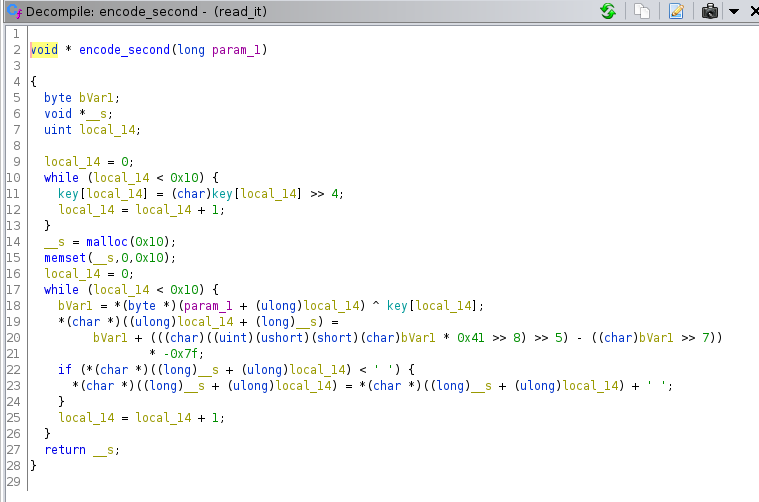

# CTF: All-Army Cyberstakes 2020

- Challenge: Read It And Weep    
- Category: Reverse Engineering    	
- Points: 100   
- Difficulty: Introductory    

## Instructions:

We've found a mysterious binary lying around... Can you read it's secrets? challenge.acictf.com:8824 read_it

## Hints:

There are two parts to the hidden message...

A disassembler will help you make sense of the obfuscation

A XOR B = C ::: A = C XOR B

## Solution

We are given a binary and are told to find the secrets. After running the file command on the executable we get the following information.

We can see that the file is 64-bit executable, X86-64 architecture, dynamically linked, and not stripped.

Since it is not stripped we can see if there are any useful labels using objdump command with -t option.

We can see couple of functions that look interesting.

Lets check out our executable in ghidra.

In main function we can see that we are asked to input some string which is either going to be correct and print our flag (line 24-26) or be incorrect (lines 28-30)

We can also see that our input is encoded using two different functions: encode_first and encode_second. Lets see what these functions do on the user input.

There seems to be some loop where we go though 10 times and perform some arithmetic operations on the given argument. The function is quite ugly. Lets hold on to analyzing the details of the function for now.

for encode_second we have something similar to encode_first. While loop with a counter (10 repeats) and arithmetic operations.

After going though encode_first function our input (now encoded) is being compared to the secret1. And inside this if statement there is another comparison to secret2.

## Flag

## Mitigation:

