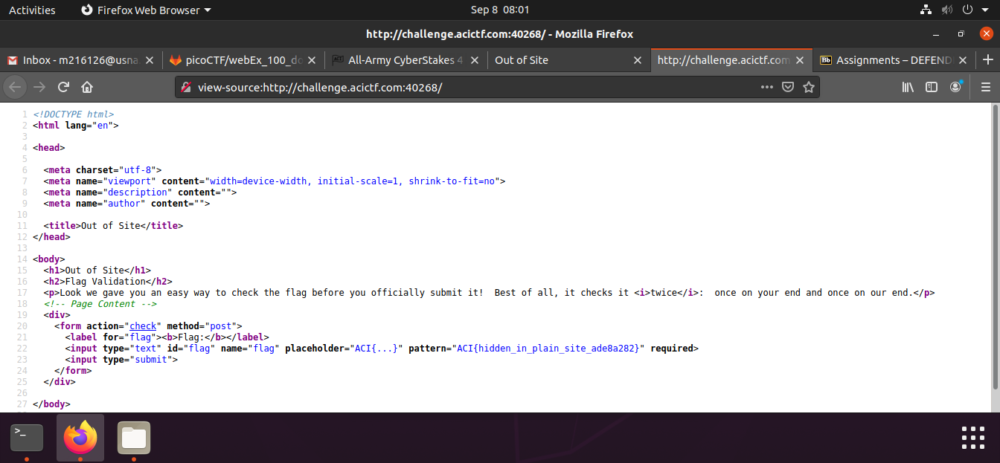

## Out Of Site

Points: 5  
Difficulty: Easy  
Category: Web

## Summary
The flag submission system lets us see the strings you submitted even when they're wrong. Since some of you may consider that a privacy issue, we decided to demo a flag validation system that checks it client-side before sending the flag to us for checking. Why don't you give it a try: http://challenge.acictf.com:40268

## Hints
How does your browser know what the right key is to do the check?
If only there were a way to control+U're view of what the server sent you.

## Solution
This is our first easy challenge for the web part of ACIctf. We are greeted by the following page when we go to the challenge link.

As any other web problem we start by inspecting the source code.

## Flag
`ACI{hidden_in_plain_site_ade8a282}`

## Mitigation
Critical information such as PII should be hidden from the general user and not be available in the source code which everyone can access.
