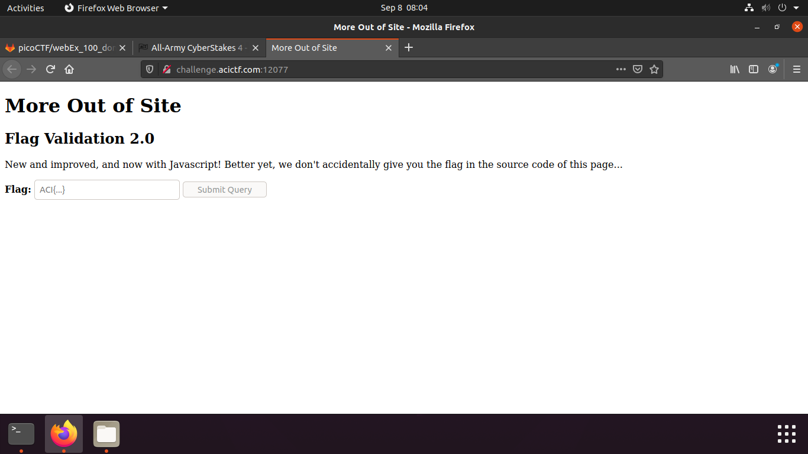
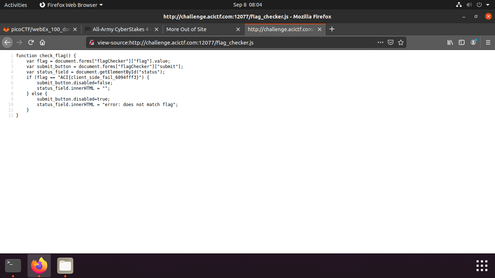

## More Out Of Site

Points: 10  
Difficulty: easy    
Category: web

## Summary
Well that was embarrassing... Who knew there was more to a web site then what the browser showed? Not to worry, we're back with a new and improved Javascript version! http://challenge.acictf.com:12077

## Hints
The Javascript code in an onInput gets called anytime you interact with a text field.Is there anyway to view the Javascript definition of this function?
It should just be text and your browser has it somewhere (it is running it after all).

## Solution
The problem says that they don't give us the flag in the source code anymore. 

However, when we look at the source code we see the flag checker javascript file which is ran when user inputs the flag. Lets check it out.

And here we go. We can see that the flag gets checked on the client side. Now we can easily retrieve the flag.

## Flag

`ACI{client_side_fail_6094fff3}`

## Mitigation

Client side checking for passwords and flags can cause big problems. These actions should be performed on the server side instead.
