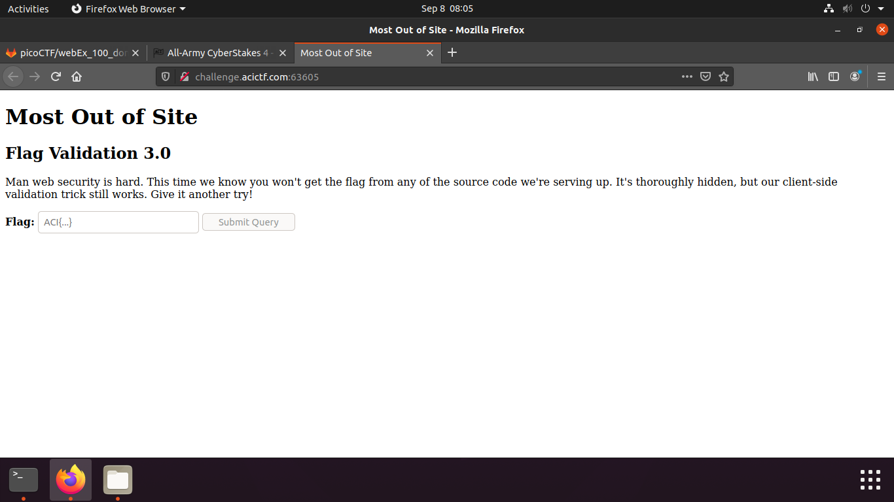
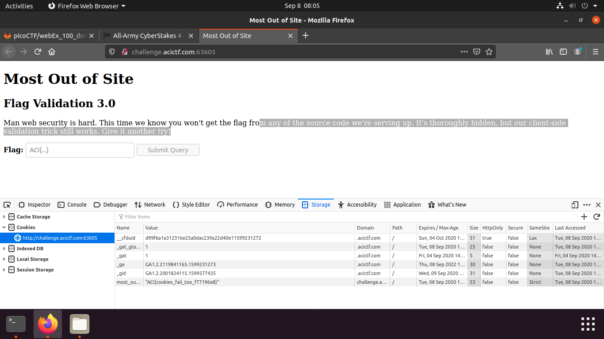

## Most out of Site

Points: 20  
Difficulty: Easy    
Category: Web   

## Summary

Alright, one more try. We had to think long and hard about how to keep you from viewing the flag. After a quick snack break, we had an epiphany. Your tricks won't work this time. http://challenge.acictf.com:63605

## Hints

What on earth could snack food have to do with this problem?    
The browser must be storing these cookies somewhere...  
If you're getting tired of using a browser, the Python Requests library is pretty useful for interacting with web servers.

## Solution

This problem tells us that we wont be able to find the flag in any of the source code.  

	

One of the hints told us that the cookie must be stored somewhere. So I decided to check the cookies.

	

## Flag

`ACI{cookies_fail_too_f77196ab}`

## Mitigation

Sensitive data should not be stored in the cookies.
