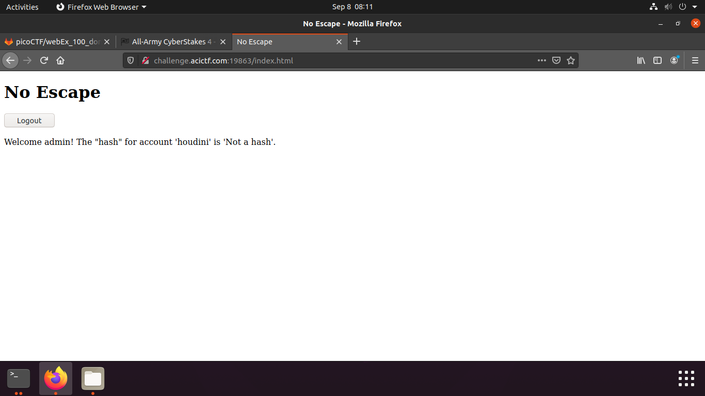

## No Escape

Points: 60
Difficulty: Easy
Category: Web

## Summary

Since in-person events are currently banned, some magician we've never heard of is trying to sell us on the idea of a "digital" magic show where the magician logs in using an impossible password. For added assurances, one lucky audience member is able to login and see the hash of the password as proof the password is impossible. We're willing to bet the secret to this magic trick is not all that complicated. http://challenge.acictf.com:19863

## Hints

- Inexperienced web application developers don't always esacpe/sanitize user inputs in there database query strings. This frequently allows SQL injection attacks that result in unintended behavior. 
- The developer was pretty new, so just causing the query to error out may get you more information for the exploit. What happens when you use a single ' or " in each of the login fields?   
- You'll need to login as a specific user. If you're new to SQL syntax, this might be useful resource for understanding the intended query and how you can manipulate it for your purposes.

## Solution

When we visit the website we are presented with the following login screen.

After a couple of test inputsd I figured out that this is a SQL injection problem. Where we are told to log in without a password.
My first sql input was the following `' admin` and a random password. We get an sql query error which looks interesting.

We can see that we can inject SQL queries. This allows us to comment out the part where the password gets checked which will bypass the password. Using `admin '--' ` as a login I was able to log in as admin.

We can see that the problem talks about houdini being able to log in using the impossible password. Lets try to log in as houdini instead of admin. Lets try the following input `houdini '--' `

## Flag

`ACI{7d7366fc02aadeb077ab7c7cc1f}`

## Mitigation

In order to avoid this problem we have to make sure the SQL queries are parametrized and the users can not use the input boxes for their sql queries.