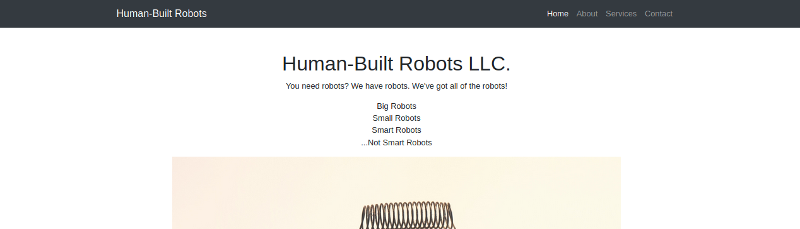
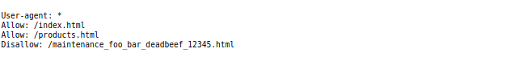
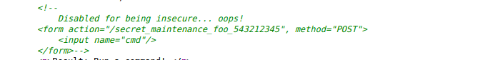

## Denied

- Points: 75
- Difficulty: Easy
- Category: Web

## Summary

Sometimes websites are afraid of the terminator finding things out. http://challenge.acictf.com:1542 The flag is in flag.txt.

## Hints

- How can websites keep search engines from finding private information?      
- Sometimes the developers leave some comments that give you a hint about what to do...	
- You can use the cat command to read files

## Solution

We are given some hints in the summary and hints section before we even begin. We know it will have to do something with robots.txt. Robots text file tells search engine crawlers which pages or files crawler can or can not request from the site.

I started by going to /robots.txt.

Here we can see that we have a disallow and the web address also looks interesting. It seems to be some maintenance page. Lets check it out.

Seems like the website is supposed to run some type of a command but there is no input box for us. Let's check out the source code because the developers sometimes leave useful information in there.

This look interesting! The commented out seciton says that the part of the code is disabled because it was insecure. Thats exactly what we need!
I tried to uncomment the commentout portion but for some reason I was not successful. However I was able to edit code in html, copy our desired lines and put it in a new location without comment tags.

And it gives us the input box for the commands. Since we know the name of the flag file is flag.txt lets try to cat the file.

And Voila! here is our flag

## Flag
`ACI{738c452737622622bb10b217b20}`

## Mitigation

There are many things that went wrong with this website. First we have to make sure to use Noindex instead of Disallow for pages that are private yet publicly accessible. Also we have to make sure the commented out code does not contain sensitive information. In addition to this we have to be careful how much access we are giving the users!
